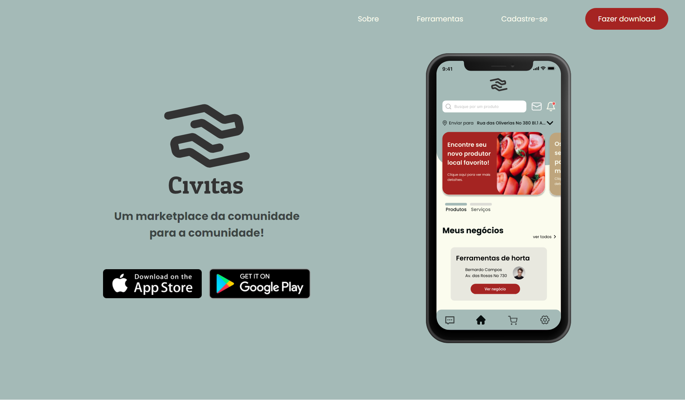
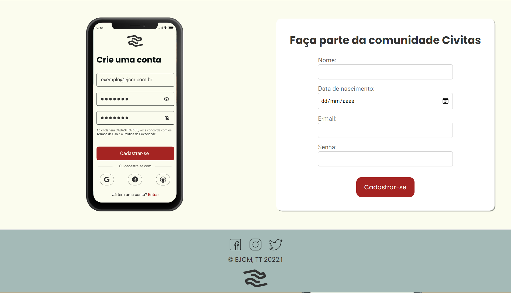

# Landing Page do app Civitas

Landing Page realizada na tarefa do **Treinamento Técnico 2022.1 da EJCM** com o objetivo de promover o app Civitas.

Acesse o site com o Github Pages em [https://vlimass.github.io/Civitas_Landing_Page-TT_EJCM/](https://vlimass.github.io/Civitas_Landing_Page-TT_EJCM/).

## O que é o Civitas?
> Civitas: Um marketplace da comunidade para a comunidade!

Civitas é um marketplace de produtos e serviços criados pela comunidade e para a comunidade. Ele conecta compradores, vendedores locais e pequenos produtores.

## Ferramentas do Civitas
> Explore! Publique! Negocie!

Com o objetivo de poupar o tempo do usuário e impulsionar a economia da região, o Civitas possibilita que comerciantes, provedores de serviços locais, bem como toda a população local explore, publique e negocie produtos e serviços.

## Imagens do projeto

